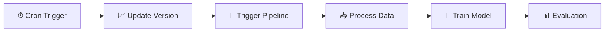
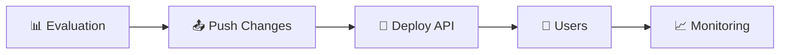

# 🎬🎞📶 Movie Recommendation System 

This project was created as part of the MLOps bootcamp (Sep24) 🛠👷🏻‍♂️. The project demonstrates a comprehensive MLOps implementation for deploying and maintaining a movie recommendation system.

Project Repository: [Dagshub](https://dagshub.com/castolpe/sep24_bmlops_int_reco_films)

## 💻 Developer Team:
- Asma Heena Khalil ([@asma484](https://github.com/asma484))
- Ringo Schwabe ([@roongi](https://github.com/roongi))
- Carolin Stolpe ([@castolpe](https://github.com/castolpe))

## Business Objectives

The Movie Recommendation application addresses the challenge of providing personalized movie recommendations to users on a streaming platform. By leveraging collaborative filtering techniques, it enhances the user experience by suggesting movies that align with individual tastes. Sponsored by a streaming service, the project aims to:

- Increase user engagement through personalized content recommendations
- Improve user retention by suggesting relevant movies
- Enhance content discovery across the platform's catalog
- Drive higher user satisfaction through accurate recommendations

## 🔄 MLOps Workflow Overview


> 📝 View the [high-resolution SVG version](workflow_diagrams/mlops_workflow_latest.svg) for better detail.

### 🎯 Detailed Pipeline Steps

Our MLOps pipeline consists of five major components, each handling specific aspects of the machine learning lifecycle:

#### 1️⃣ CI/CD Pipeline (GitHub Actions) 
- ⏰ **Scheduled Trigger**: Daily at midnight
- 📈 **Data Version Update**: Increments data version
- 🚀 **Pipeline Trigger**: Initiates DVC pipeline
- 📤 **Main Branch Update**: Pushes changes
- 🔄 **API Deployment**: Triggers new deployment (in progress 🚧)

#### 2️⃣ DVC Pipeline (MLFlow/DVC)
- 📥 **Data Ingestion**: Appends new data
- ✅ **Validation**: Ensures data quality
- 🔄 **Transformation**: Prepares features
- 🧠 **Model Training**: Updates model
- 📊 **Evaluation**: Assesses performance

#### 3️⃣ Experiment Monitoring
- 📚 **MLFlow Registry**: Tracks experiments
- 💾 **DVC Version Control**: Manages artifacts

#### 4️⃣ Deployed Application
- 🆕 **API Updates**: New versions (🚧)
- 👥 **User Interaction**: Real-time recommendations

#### 5️⃣ Monitoring Stack
- 📈 **Metrics Collection**: Prometheus
- 📊 **Dashboard**: Grafana
- ⚠️ **Alerts**: AlertManager (🚧)

### 🔄 Pipeline Interactions

1. **Data Update Cycle**


2. **Deployment Cycle**


### 🛠 Component Details

#### 1. Data Pipeline & Version Control
```bash
# Data versioning workflow
├── 📥 Data Ingestion
├── ✅ Validation
├── 🔄 Transformation
├── 🧠 Training
└── 📊 Evaluation
```

#### 2. Model Training & Deployment
```bash
# Model lifecycle
├── 🧪 Experiment Tracking (MLFlow)
├── 📊 Performance Metrics
├── 📦 Containerization (Docker)
└── 🚀 API Deployment (FastAPI)
```

#### 3. Monitoring & Alerts
```bash
# Monitoring stack
├── 📈 Metrics (Prometheus)
├── 📊 Visualization (Grafana)
└── ⚠️ Alerting (AlertManager)
```

### 🔍 Workflow Deep Dive

#### 1. Data Update Process
1. ⏰ **Trigger**: Daily at midnight
2. 📈 **Version Update**: Increment data version
3. 🚀 **Pipeline Start**: Trigger DVC pipeline
4. 📥 **Data Processing**: Execute pipeline stages
5. 📊 **Validation**: Ensure quality metrics

#### 2. Model Training Cycle
1. 🧠 **Training**: Update model with new data
2. 📊 **Evaluation**: Calculate performance metrics
3. 📚 **Registry**: Record in MLFlow
4. 💾 **Versioning**: Save with DVC
5. 📤 **Push**: Update main branch

#### 3. Deployment Process
1. 🔄 **Trigger**: New model version available
2. 📦 **Container**: Build new Docker image and push to Docker Hub
3. 🚀 **Deploy**: Update API service (🚧)
4. 👥 **Users**: Serve new predictions
5. 📈 **Monitor**: Track performance

### 📊 Monitoring & Feedback

#### Real-time Metrics
- 🔍 **API Performance**
  - Response times
  - Request volumes
  - Error rates

- 📈 **Model Metrics**
  - Prediction accuracy
  - Processing time
  - Resource usage

- ⚠️ **Alerts**
  - Performance degradation
  - Error thresholds
  - Resource constraints

## Technical Architecture

### Data Flow
1. Raw data ingestion (`data/raw/`)
2. Data preprocessing (`data/interim/`)
3. Feature engineering (`data/processed/`)
4. Model training (`models/`)
5. API deployment

### Component Structure
```
src/
├── api/                    # FastAPI implementation
├── data_module_def/        # Data processing modules
├── models_module_def/      # Model definition and training
├── pipeline_steps/         # DVC pipeline stages
└── utils/                  # Helper functions
```

## Getting Started

### 1. Clone the project
```bash
git clone https://github.com/DataScientest-Studio/sep24_bmlops_int_reco_films.git
cd /sep24_bmlops_int_reco_films
```

### 2. Setup virtual environment & install dependencies
```bash
python3 -m venv venv
source venv/bin/activate
pip install -r requirements.txt
```

### 3. Configure DVC and download data
```bash
# Configure access to DVC
dvc remote modify origin --local access_key_id YOUR_DVC_ACCESS_KEY
dvc remote modify origin --local secret_access_key YOUR_DVC_ACCESS_KEY

# Pull the data
dvc pull
```

### 4. Launch the application
```bash
docker-compose up
```

### 5. API Usage

#### Health Check
```bash
curl -X GET http://0.0.0.0:8000/status
```

#### Get Recommendations
```bash
curl -X 'POST' \
  'http://localhost:8000/users/recommendations' \
  -H 'accept: application/json' \
  -H 'Content-Type: application/json' \
  -d '{
  "animation": 5,
  "children": 3,
  "comedy": 2,
  // ... other genre preferences
}'
```

### 6. Monitoring Dashboard

Access the Grafana dashboard at: http://localhost:3000/d/_eX4mpl3/fastapi-dashboard

## 🚀 Future Improvementes

The next steps we want to implement in the project:

- [ ] Enhance CI/CD Pipeline and automate deployment🔄
- [ ] Improve machine learning model 🧠
- [ ] Implement user feedback system 🌐
- [ ] Use Airflow for pipeline orchestration 🛠
- [ ] Implement Kubernetes deployment (scalability) 🛠
- [ ] Implement alertmanager for drift detection 📊
- [ ] Add testing suite 🔍
- [ ] Enhance API security by adding OAuth2 authentication 🔐

## License

This project is licensed under the MIT License - see the [LICENSE](LICENSE) file for details.
