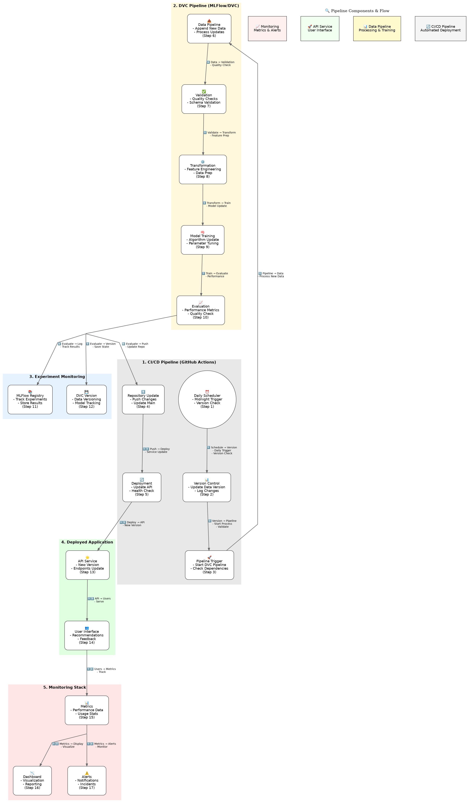
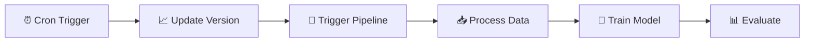

# 🎬🎞📶 Movie Recommendation System 

This project was created as part of the MLOps bootcamp (Sep24) 🛠👷🏻‍♂️. The project demonstrates a comprehensive MLOps implementation for deploying and maintaining a movie recommendation system.

Project Repository: [Dagshub](https://dagshub.com/castolpe/sep24_bmlops_int_reco_films)

## 💻 Developer Team:
- Asma Heena Khalil
- Ringo Schwabe 
- Carolin Stolpe ([@castolpe](https://github.com/castolpe))

## Business Objectives

The Movie Recommendation application addresses the challenge of providing personalized movie recommendations to users on a streaming platform. By leveraging collaborative filtering techniques, it enhances the user experience by suggesting movies that align with individual tastes. Sponsored by a streaming service, the project aims to:

- Increase user engagement through personalized content recommendations
- Improve user retention by suggesting relevant movies
- Enhance content discovery across the platform's catalog
- Drive higher user satisfaction through accurate recommendations

## 🔄 MLOps Workflow Overview



> 📝 View the [high-resolution SVG version](workflow_diagrams/mlops_workflow_latest.svg) for better detail.

### 🎯 Detailed Pipeline Steps

Our MLOps pipeline consists of five major components, each handling specific aspects of the machine learning lifecycle:

#### 1️⃣ CI/CD Pipeline (GitHub Actions) 
- ⏰ **Scheduled Trigger**: Daily at midnight
- 📈 **Data Version Update**: Increments data version
- 🚀 **Pipeline Trigger**: Initiates DVC pipeline
- 📤 **Main Branch Update**: Pushes changes
- 🔄 **API Deployment**: Triggers new deployment

#### 2️⃣ DVC Pipeline (MLFlow/DVC)
- 📥 **Data Ingestion**: Appends new data
- ✅ **Validation**: Ensures data quality
- 🔄 **Transformation**: Prepares features
- 🧠 **Model Training**: Updates model
- 📊 **Evaluation**: Assesses performance

#### 3️⃣ Experiment Monitoring
- 📚 **MLFlow Registry**: Tracks experiments
- 💾 **DVC Version Control**: Manages artifacts

#### 4️⃣ Deployed Application
- 🆕 **API Updates**: New versions
- 👥 **User Interaction**: Real-time recommendations

#### 5️⃣ Monitoring Stack
- 📈 **Metrics Collection**: Prometheus
- 📊 **Dashboard**: Grafana
- ⚠️ **Alerts**: AlertManager

### 🔄 Pipeline Interactions

1. **Data Update Cycle**


2. **Deployment Cycle**


### 🛠 Component Details

#### 1. Data Pipeline & Version Control
```bash
# Data versioning workflow
├── 📥 Data Ingestion
├── ✅ Validation
├── 🔄 Transformation
├── 🧠 Training
└── 📊 Evaluation
```

#### 2. Model Training & Deployment
```bash
# Model lifecycle
├── 🧪 Experiment Tracking (MLFlow)
├── 📊 Performance Metrics
├── 📦 Containerization (Docker)
└── 🚀 API Deployment (FastAPI)
```

#### 3. Monitoring & Alerts
```bash
# Monitoring stack
├── 📈 Metrics (Prometheus)
├── 📊 Visualization (Grafana)
└── ⚠️ Alerting (AlertManager)
```

### 🔍 Workflow Deep Dive

#### 1. Data Update Process
1. ⏰ **Trigger**: Daily at midnight
2. 📈 **Version Update**: Increment data version
3. 🚀 **Pipeline Start**: Trigger DVC pipeline
4. 📥 **Data Processing**: Execute pipeline stages
5. 📊 **Validation**: Ensure quality metrics

#### 2. Model Training Cycle
1. 🧠 **Training**: Update model with new data
2. 📊 **Evaluation**: Calculate performance metrics
3. 📚 **Registry**: Record in MLFlow
4. 💾 **Versioning**: Save with DVC
5. 📤 **Push**: Update main branch

#### 3. Deployment Process
1. 🔄 **Trigger**: New model version available
2. 📦 **Container**: Build new Docker image
3. 🚀 **Deploy**: Update API service
4. 👥 **Users**: Serve new predictions
5. 📈 **Monitor**: Track performance

### 📊 Monitoring & Feedback

#### Real-time Metrics
- 🔍 **API Performance**
  - Response times
  - Request volumes
  - Error rates

- 📈 **Model Metrics**
  - Prediction accuracy
  - Processing time
  - Resource usage

- ⚠️ **Alerts**
  - Performance degradation
  - Error thresholds
  - Resource constraints

## Technical Architecture

### Data Flow
1. Raw data ingestion (`data/raw/`)
2. Data preprocessing (`data/interim/`)
3. Feature engineering (`data/processed/`)
4. Model training (`models/`)
5. API deployment

### Component Structure
```
src/
├── api/                    # FastAPI implementation
├── data_module_def/        # Data processing modules
├── models_module_def/      # Model definition and training
├── pipeline_steps/         # DVC pipeline stages
└── utils/                  # Helper functions
```

## Getting Started

### 1. Clone the project
```bash
git clone https://github.com/DataScientest-Studio/sep24_bmlops_int_reco_films.git
cd /sep24_bmlops_int_reco_films
```

### 2. Setup virtual environment & install dependencies
```bash
python3 -m venv venv
source venv/bin/activate
pip install -r requirements.txt
```

### 3. Configure DVC and download data
```bash
# Configure access to DVC
dvc remote modify origin --local access_key_id YOUR_DVC_ACCESS_KEY
dvc remote modify origin --local secret_access_key YOUR_DVC_ACCESS_KEY

# Pull the data
dvc pull
```

### 4. Launch the application
```bash
docker-compose up
```

### 5. API Usage

#### Health Check
```bash
curl -X GET http://0.0.0.0:8000/status
```

#### Get Recommendations
```bash
curl -X 'POST' \
  'http://localhost:8000/users/recommendations' \
  -H 'accept: application/json' \
  -H 'Content-Type: application/json' \
  -d '{
  "animation": 5,
  "children": 3,
  "comedy": 2,
  // ... other genre preferences
}'
```

### 6. Monitoring Dashboard

Access the Grafana dashboard at: http://localhost:3000/d/_eX4mpl3/fastapi-dashboard

## MLOps Workflow Achievements

1. **Data Management**
   - Automated data ingestion and validation
   - Version control with DVC
   - Data quality checks

2. **Model Development**
   - Modular training pipeline
   - Hyperparameter management
   - Model versioning

3. **Deployment**
   - Containerized application
   - API endpoint implementation
   - Environment consistency

4. **Monitoring**
   - Real-time performance tracking
   - Resource utilization monitoring
   - Alert system implementation

5. **CI/CD**
   - Automated testing
   - Continuous deployment
   - Pipeline automation

## Contributing

Please read [CONTRIBUTING.md](CONTRIBUTING.md) for details on our code of conduct and the process for submitting pull requests.

## License

This project is licensed under the MIT License - see the [LICENSE](LICENSE) file for details.

## Detailed User Guide

### System Architecture Overview

Our movie recommendation system implements a comprehensive MLOps pipeline with four core components:

1. **CI/CD Pipeline (GitHub Actions)**
   - Automated testing and deployment
   - Daily data updates at midnight
   - Continuous integration checks
   - Automated Docker image rebuilding

2. **Data Version Control Pipeline (DVC)**
   - Data versioning and experiment tracking
   - Reproducible data processing steps
   - Model artifact management
   - Pipeline orchestration

3. **Model Deployment (FastAPI)**
   - RESTful API endpoints
   - Real-time recommendations
   - Containerized deployment
   - Scalable architecture

4. **Monitoring System (Prometheus/Grafana)**
   - Real-time performance tracking
   - Resource utilization monitoring
   - Custom metrics collection
   - Automated alerting

### Detailed Workflow

#### 1. Data Pipeline Operations

```bash
# Update data version manually
dvc repro data_update

# Run complete pipeline
dvc repro

# Check pipeline status
dvc status
```

The data pipeline includes:
- Daily automated updates at midnight
- Data quality validation
- Feature engineering
- Version tracking

#### 2. Model Training Workflow

```bash
# Train new model
python src/pipeline_steps/stage06_model_train.py

# Evaluate model
python src/pipeline_steps/stage07_model_evaluate.py
```

Training process includes:
- Automated feature selection
- Hyperparameter optimization
- Model validation
- Performance metrics tracking

#### 3. API Interaction Guide

The FastAPI application provides several endpoints:

```python
# Health check
GET /status

# Get movie recommendations
POST /users/recommendations
{
    "no_genres_listed": 0,
    "action": 0,
    "adventure": 0,
    "animation": 5,
    "children": 3,
    "comedy": 2,
    ...
}

# Get model metrics
GET /metrics
```

#### 4. Monitoring Setup

1. **Prometheus Configuration**
```yaml
# monitoring/prometheus/prometheus.yml
scrape_configs:
  - job_name: 'fastapi'
    static_configs:
      - targets: ['fastapi:8000']
```

2. **Grafana Dashboard Access**
- URL: http://localhost:3000
- Default credentials:
  - Username: admin
  - Password: admin

### Project Structure Deep Dive

```
sep24_bmlops_int_reco_films/
├── src/                           # Source code
│   ├── api/                       # FastAPI application
│   ├── data_module_def/           # Data processing
│   ├── models_module_def/         # Model implementation
│   └── pipeline_steps/            # DVC pipeline stages
├── monitoring/                    # Monitoring setup
│   ├── alertmanager/             # Alert configuration
│   ├── grafana/                  # Dashboards
│   └── prometheus/               # Metrics collection
├── data/                         # Data storage
│   ├── raw/                      # Original data
│   ├── interim/                  # Preprocessed data
│   └── processed/                # Final features
└── models/                       # Model artifacts
```

### Quality Assurance

1. **Automated Tests**
```bash
# Run all tests
python -m pytest tests/

# Run specific test suite
python -m pytest tests/test_model.py
```

2. **Data Validation**
- Schema validation
- Data quality checks
- Missing value detection
- Anomaly detection

3. **Model Performance Metrics**
- Intra-list similarity
- Recommendation accuracy
- Response time
- Resource utilization

### Troubleshooting Guide

1. **Common Issues**

```bash
# DVC issues
dvc doctor

# Docker issues
docker-compose logs

# API issues
curl http://localhost:8000/status
```

2. **Monitoring Alerts**
- Check Alertmanager UI: http://localhost:9093
- Review alert rules in `monitoring/prometheus/alert_rules.yml`
- Check Grafana alerts dashboard

### Development Workflow

1. **Local Development**
```bash
# Create feature branch
git checkout -b feature/new-feature

# Start development environment
docker-compose up -d

# Run tests
pytest

# Submit changes
git push origin feature/new-feature
```

2. **Pipeline Updates**
```bash
# Modify pipeline stages
vim dvc.yaml

# Test changes
dvc repro -f

# Commit updates
dvc commit
```

### Maintenance Tasks

1. **Regular Updates**
- Daily data updates (automated)
- Weekly model retraining
- Monthly performance review

2. **Backup Procedures**
```bash
# Backup DVC cache
dvc push

# Backup Docker images
docker save -o backup.tar image_name
```

## 🚀 Future Improvements

### 1. 🔄 Pipeline Enhancements
- **Automated Model Retraining**
  - Implement drift detection
  - Add automated retraining triggers
  - Develop A/B testing framework

- **Advanced Data Processing**
  - Add feature store integration
  - Implement real-time data processing
  - Enhance data validation pipelines

### 2. 🧠 Model Improvements
- **Advanced Algorithms**
  - Implement deep learning models
  - Add hybrid recommendation approaches
  - Develop content-based filtering

- **Model Optimization**
  - Add model compression techniques
  - Implement model quantization
  - Enhance inference speed

### 3. 🛠 Infrastructure Updates
- **Scalability**
  - Implement Kubernetes deployment
  - Add horizontal scaling capabilities
  - Enhance load balancing

- **Security**
  - Add OAuth2 authentication
  - Implement role-based access
  - Enhance API security

### 4. 📊 Monitoring Enhancements
- **Advanced Analytics**
  - Add custom monitoring dashboards
  - Implement predictive alerts
  - Enhanced metric collection

- **User Analytics**
  - Add user behavior tracking
  - Implement A/B testing metrics
  - Enhanced recommendation analytics

### 5. 🔍 Quality Assurance
- **Testing**
  - Add integration test suite
  - Implement performance testing
  - Enhanced unit test coverage

- **Documentation**
  - Add API documentation
  - Enhanced user guides
  - Developer documentation

### 6. 🌐 User Experience
- **Interface**
  - Add web interface for monitoring
  - Implement user feedback system
  - Enhanced recommendation explanations

- **API Features**
  - Add batch prediction endpoints
  - Implement streaming recommendations
  - Add recommendation diversity controls

### 7. 📈 Performance Optimization
- **Speed**
  - Optimize model inference
  - Enhance data processing pipeline
  - Implement caching strategies

- **Resource Usage**
  - Optimize memory usage
  - Enhance CPU utilization
  - Implement resource monitoring

### 8. 🔐 Data Management
- **Privacy**
  - Implement data anonymization
  - Add privacy-preserving features
  - Enhanced data security

- **Storage**
  - Implement data archival
  - Add data lifecycle management
  - Optimize storage usage