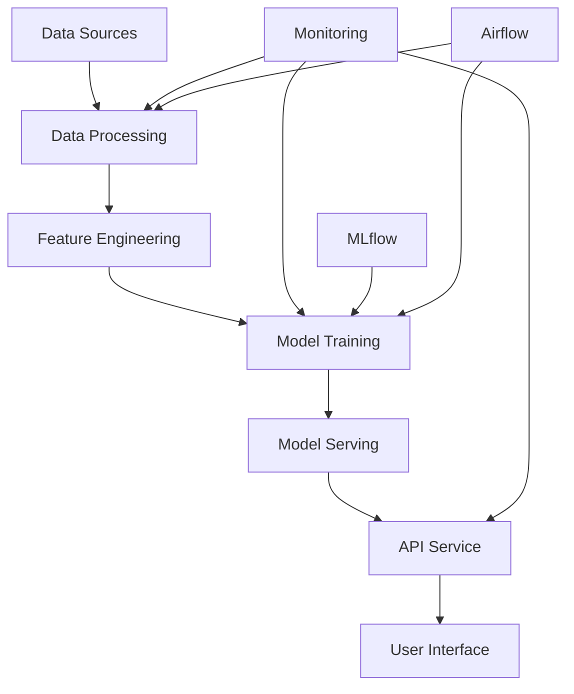

# Movie Recommendation System - Complete Implementation Guide

## Table of Contents
1. [System Architecture](#system-architecture)
2. [Data Pipeline](#data-pipeline)
3. [Model Training](#model-training)
4. [API Service](#api-service)
5. [Monitoring](#monitoring)
6. [MLOps Components](#mlops-components)
7. [Deployment](#deployment)
8. [Maintenance](#maintenance)

## System Architecture

### Overview
The system is built using a microservices architecture with the following components:

1. **Data Layer**
   - PostgreSQL database for persistent storage
   - Redis for caching
   - DVC for data versioning

2. **Model Layer**
   - Collaborative filtering model
   - Feature engineering pipeline
   - Model versioning with MLflow

3. **API Layer**
   - FastAPI service
   - JWT authentication
   - Rate limiting
   - Request validation

4. **Monitoring Layer**
   - Prometheus metrics collection
   - Grafana dashboards
   - Custom alerting system

### Component Integration


## Data Pipeline

### Data Processing
1. **Initial Data Load**
   ```bash
   python src/data/init_db.py --force-reset
   python src/data/step1.py
   ```

2. **Feature Engineering**
   ```bash
   python src/features/build_features.py
   ```

### Airflow DAGs
1. **Data Processing DAG**
   ```python
   # airflow/dags/data_processing_dag.py
   with DAG('data_processing', ...) as dag:
       load_data = PythonOperator(...)
       process_features = PythonOperator(...)
       validate_data = PythonOperator(...)
   ```

2. **Model Training DAG**
   ```python
   # airflow/dags/model_training_dag.py
   with DAG('model_training', ...) as dag:
       train_model = PythonOperator(...)
       evaluate_model = PythonOperator(...)
       update_production = PythonOperator(...)
   ```

## Model Training

### Training Process
1. Data preparation
2. Feature engineering
3. Model training
4. Evaluation
5. Deployment decision

### MLflow Integration
```python
with mlflow.start_run():
    # Train model
    mlflow.log_params(params)
    mlflow.log_metrics(metrics)
    mlflow.sklearn.log_model(model, "model")
```

## API Service

### Endpoints
1. **User Management**
   - POST /users/register
   - POST /users/login
   - GET /users/me

2. **Recommendations**
   - GET /recommendations/{user_id}
   - POST /feedback
   - GET /similar-movies/{movie_id}

### Authentication
```python
@app.post("/token")
async def login(form_data: OAuth2PasswordRequestForm):
    user = authenticate_user(form_data.username, form_data.password)
    access_token = create_access_token(data={"sub": user.username})
    return {"access_token": access_token, "token_type": "bearer"}
```

## Monitoring

### Metrics Collection
1. **Model Performance**
   - RMSE
   - MAE
   - Precision@K
   - Recall@K

2. **System Health**
   - API latency
   - Database connections
   - Cache hit rate

### Grafana Dashboards
1. Model Performance Dashboard
2. User Activity Dashboard
3. System Health Dashboard
4. Data Drift Dashboard

## MLOps Components

### Continuous Integration
```yaml
# .github/workflows/ci.yml
name: CI
on: [push, pull_request]
jobs:
  test:
    runs-on: ubuntu-latest
    steps:
      - uses: actions/checkout@v2
      - name: Run tests
        run: pytest tests/
```

### Continuous Deployment
```yaml
# .github/workflows/cd.yml
name: CD
on:
  push:
    branches: [main]
jobs:
  deploy:
    runs-on: ubuntu-latest
    steps:
      - uses: actions/checkout@v2
      - name: Deploy to Kubernetes
        run: kubectl apply -f deployment/
```

## Deployment

### Docker Deployment
```bash
# Build images
docker build -t movie-recommender:latest .
docker-compose up -d

# Scale services
docker-compose up -d --scale api=3
```

### Kubernetes Deployment
```bash
# Deploy application
kubectl apply -f deployment/kubernetes/
kubectl get pods
kubectl get services
```

## Maintenance

### Backup Procedures
1. Database backup
2. Model artifacts backup
3. Configuration backup

### Monitoring Alerts
1. Model performance degradation
2. System resource utilization
3. API error rates

### Update Procedures
1. Database migrations
2. Model updates
3. API version management

## Security

### Authentication
1. JWT token implementation
2. Role-based access control
3. API key management

### Data Protection
1. Data encryption
2. Secure communication
3. Access logging

## Development Workflow

### Local Development
```bash
# Setup environment
python -m venv venv
source venv/bin/activate
pip install -r requirements.txt

# Run tests
pytest tests/

# Start services
docker-compose up -d
```

### Production Deployment
```bash
# Deploy to production
./scripts/deploy_to_production.sh

# Monitor deployment
kubectl get pods -w
```

## Troubleshooting

### Common Issues
1. Database connection issues
2. Model training failures
3. API performance problems

### Debug Tools
1. Log analysis
2. Metrics visualization
3. Performance profiling

## Future Improvements

1. **Technical Enhancements**
   - Advanced model architectures
   - Real-time feature updates
   - A/B testing framework

2. **Scalability**
   - Distributed training
   - Global deployment
   - Enhanced caching

3. **User Experience**
   - Personalization improvements
   - Faster recommendations
   - Better explanations 