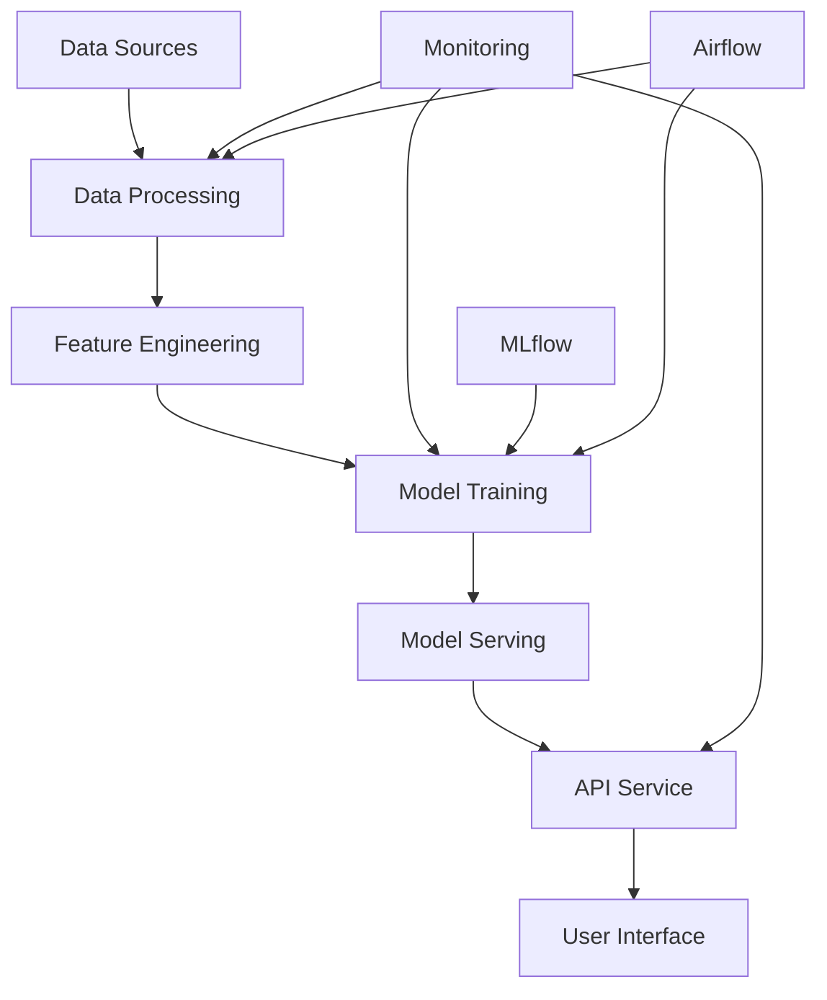

# Movie Recommendation System - Complete Project Guide

## Table of Contents

1. [Project Overview](#1-project-overview)
2. [System Architecture](#2-system-architecture)
3. [Setup and Installation](#3-setup-and-installation)
4. [Data Pipeline](#4-data-pipeline)
5. [Model Training](#5-model-training)
6. [API Service](#6-api-service)
7. [Monitoring System](#7-monitoring-system)
8. [MLOps Components](#8-mlops-components)
9. [Deployment](#9-deployment)
10. [Testing](#10-testing)
11. [Maintenance](#11-maintenance)

## 1. Project Overview

### 1.1 Purpose
The Movie Recommendation MLOps project implements a scalable, production-ready recommendation system using the MovieLens dataset. It incorporates MLOps best practices for continuous training, monitoring, and deployment.

### 1.2 Key Features
- Collaborative filtering-based recommendations
- Real-time user feedback processing
- Automated model retraining
- Comprehensive monitoring
- A/B testing capabilities
- Performance tracking

### 1.3 Technology Stack
- **Backend**: Python, FastAPI
- **Database**: PostgreSQL
- **Caching**: Redis
- **ML Framework**: scikit-learn, Surprise
- **Monitoring**: Prometheus, Grafana
- **MLOps Tools**: MLflow, Airflow, DVC
- **Deployment**: Docker, Kubernetes

## 2. System Architecture

### 2.1 Component Overview


### 2.2 Data Flow
1. Raw data ingestion
2. Data preprocessing
3. Feature engineering
4. Model training
5. Serving predictions
6. Feedback collection

### 2.3 Service Integration
- Database connections
- Cache management
- API endpoints
- Monitoring hooks

## 3. Setup and Installation

### 3.1 Prerequisites
```bash
# System requirements
python >= 3.8
postgresql >= 13
redis >= 6
docker >= 20.10
kubernetes >= 1.20
```

### 3.2 Environment Setup
```bash
# Clone repository
git clone https://github.com/yourusername/movie-recommendation.git
cd movie-recommendation

# Create virtual environment
python -m venv venv
source venv/bin/activate  # On Windows: venv\Scripts\activate

# Install dependencies
pip install -r requirements.txt
```

### 3.3 Database Setup
```bash
# Initialize database
python scripts/init_database.py --force-reset

# Load initial data
python scripts/load_initial_data.py
```

## 4. Data Pipeline

### 4.1 Data Processing
```python
# Process raw data
python src/data/data_pipeline.py

# Create features
python src/features/build_features.py
```

### 4.2 Feature Engineering
- User features
- Movie features
- Interaction features
- Temporal features

### 4.3 Data Versioning
```bash
# Initialize DVC
dvc init
dvc add data/raw
dvc push
```

## 5. Model Training

### 5.1 Training Process
```python
# Train model
python src/models/train_model.py

# Evaluate model
python src/models/evaluate_model.py
```

### 5.2 Model Versioning
```python
with mlflow.start_run():
    mlflow.log_params(params)
    mlflow.log_metrics(metrics)
    mlflow.sklearn.log_model(model, "model")
```

### 5.3 Retraining Schedule
```python
# Airflow DAG for retraining
with DAG('model_retraining', 
         schedule_interval='0 0 * * 0',  # Weekly
         catchup=False) as dag:
    train_task = PythonOperator(
        task_id='train_model',
        python_callable=train_model
    )
```

## 6. API Service

### 6.1 Endpoints
```python
@app.get("/recommendations/{user_id}")
async def get_recommendations(
    user_id: int,
    current_user: User = Depends(get_current_user)
):
    recommendations = recommend_movies(user_id)
    return {"recommendations": recommendations}
```

### 6.2 Authentication
```python
@app.post("/token")
async def login(form_data: OAuth2PasswordRequestForm):
    user = authenticate_user(form_data.username, form_data.password)
    access_token = create_access_token(data={"sub": user.username})
    return {"access_token": access_token, "token_type": "bearer"}
```

### 6.3 Rate Limiting
```python
@app.get("/recommendations/{user_id}")
@limiter.limit("10/minute")
async def get_recommendations():
    pass
```

## 7. Monitoring System

### 7.1 Metrics Collection
```python
# Define Prometheus metrics
RECOMMENDATIONS_COUNTER = Counter(
    'recommendations_total',
    'Total number of recommendations made'
)
REQUEST_TIME = Histogram(
    'request_processing_seconds',
    'Time spent processing request'
)
```

### 7.2 Dashboards
- Model performance
- User activity
- System health
- Data drift

### 7.3 Alerting
```yaml
# prometheus/alert_rules.yml
groups:
- name: MovieRecommendationAlerts
  rules:
  - alert: HighModelError
    expr: model_rmse > 1.0
    for: 5m
    labels:
      severity: critical
```

## 8. MLOps Components

### 8.1 CI/CD Pipeline
```yaml
# .github/workflows/ci_cd.yml
name: CI/CD Pipeline
on: [push, pull_request]
jobs:
  test:
    runs-on: ubuntu-latest
    steps:
      - uses: actions/checkout@v2
      - name: Run tests
        run: pytest tests/
```

### 8.2 Model Tracking
```python
# Track experiments with MLflow
mlflow.set_experiment("movie_recommendations")
with mlflow.start_run():
    mlflow.log_params(params)
    mlflow.log_metrics(metrics)
```

### 8.3 Feature Store
```python
# Store features
features = feature_store.get_features(
    feature_list=['user_features', 'movie_features'],
    entities={'user_id': user_ids}
)
```

## 9. Deployment

### 9.1 Docker Deployment
```bash
# Build and run with Docker
docker build -t movie-recommender .
docker-compose up -d
```

### 9.2 Kubernetes Deployment
```bash
# Deploy to Kubernetes
kubectl apply -f deployment/
kubectl get pods
```

### 9.3 Scaling
```bash
# Scale API service
kubectl scale deployment movie-recommender --replicas=3
```

## 10. Testing

### 10.1 Unit Tests
```bash
# Run unit tests
pytest tests/unit/
```

### 10.2 Integration Tests
```bash
# Run integration tests
pytest tests/integration/
```

### 10.3 Load Tests
```bash
# Run load tests
locust -f tests/load/locustfile.py
```

## 11. Maintenance

### 11.1 Backup Procedures
```bash
# Backup database
pg_dump movie_recommendation > backup.sql

# Backup model artifacts
aws s3 sync models/ s3://backup/models/
```

### 11.2 Monitoring Alerts
- Model performance degradation
- System resource utilization
- API error rates
- Data drift detection

### 11.3 Update Procedures
1. Database migrations
2. Model updates
3. API version management
4. Configuration updates

## Appendix

### A. Configuration Files
- Database configuration
- Model parameters
- API settings
- Monitoring configuration

### B. Troubleshooting Guide
- Common issues
- Debug procedures
- Recovery steps

### C. API Documentation
- Endpoint specifications
- Authentication
- Rate limits
- Response formats 